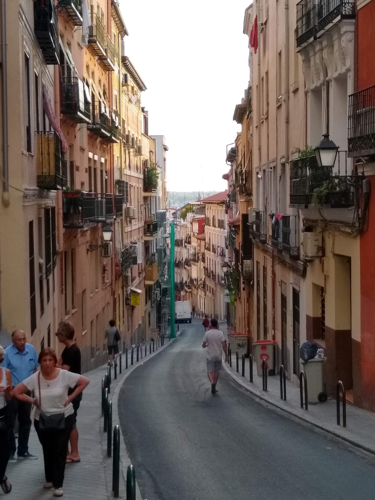
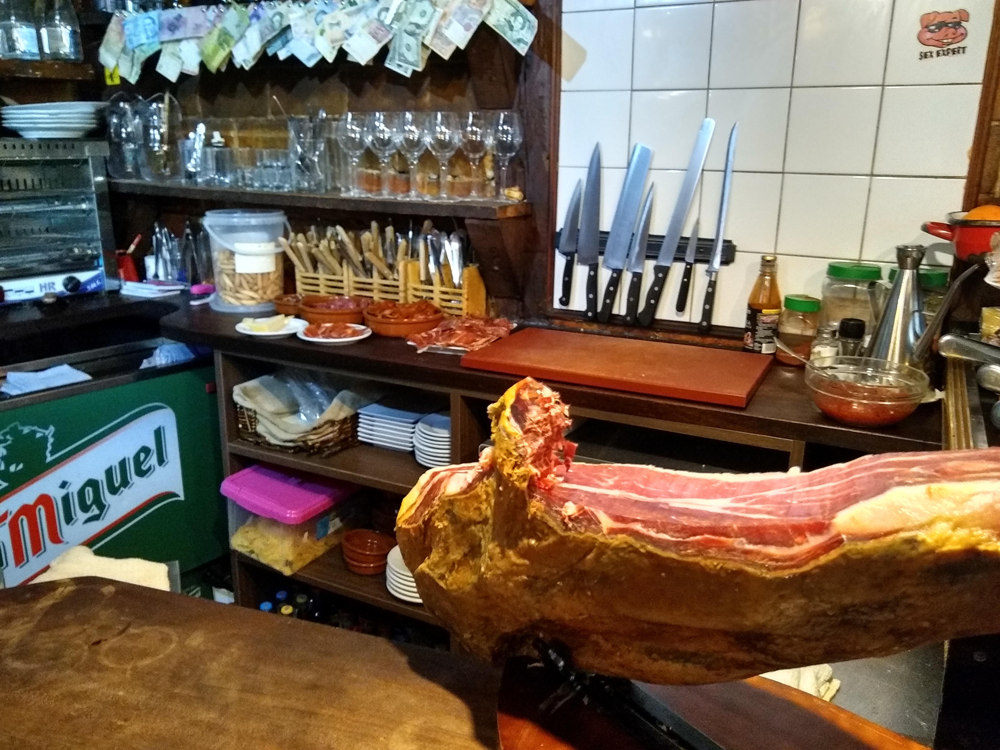

This past October, I got to travel to Madrid Spain to present my research at IROS 2018. It was a wonderful experience and I was so grateful for the opportunity. As my first trip to Europe, I was quite enamored with Madrid. Although chances are any European city would have charmed me, others told me Madrid is definitely a standout in Europe. I can't wait to make it back which is more motivation to publish my next paper!

While I'm amidst a "sophomore slump" with regards to my next publication, I have one major project in the pipeline as well as a chance to be second author on two other publications related to my own research. Two colleagues are taking my research and expanding upon it through the lens of augmented reality and natural language. These projects are likely to target the coming fall deadlines. Fall may seem far away, but time sure does go by quickly these days. 
 
This past spring break, I got to travel back to my "home away from home" (Santa Barbara) to see friends and be with Missy. It was so nice to spend time together as we're still in a long distance relationship. We had a wonderful time and got to see the California "superbloom" and spend a few days in snowy Mammoth Lakes snowboarding.
 

More recently, this week I was awarded the Departmental Award for Outstanding PhD Research and was accepted to the Deming Center Venture Fund (DCVF). The award recognizes four computer science PhD students for novel and impactful research within their field. The DCVF is a student run venture capital fund that invests in newly formed startups in the local Denver area.  Exciting stuff!
 
Spring is on its way and biking season is upon us! Whoop whoop!

