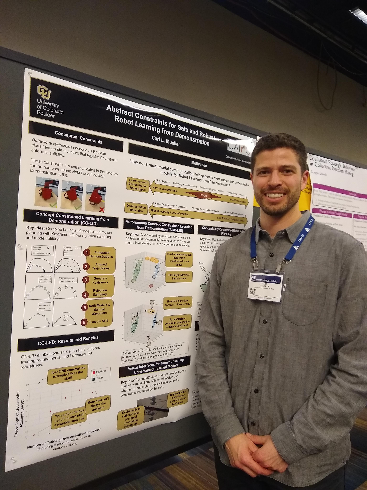
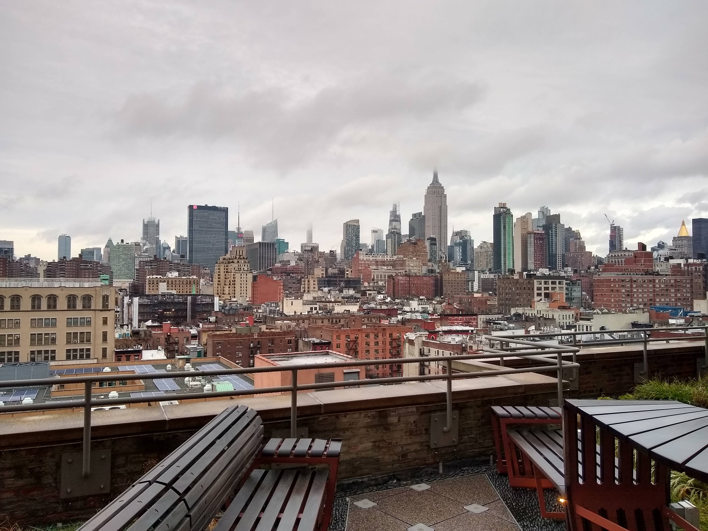
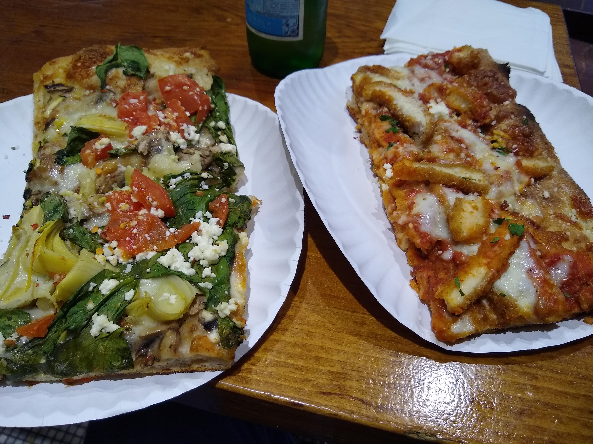
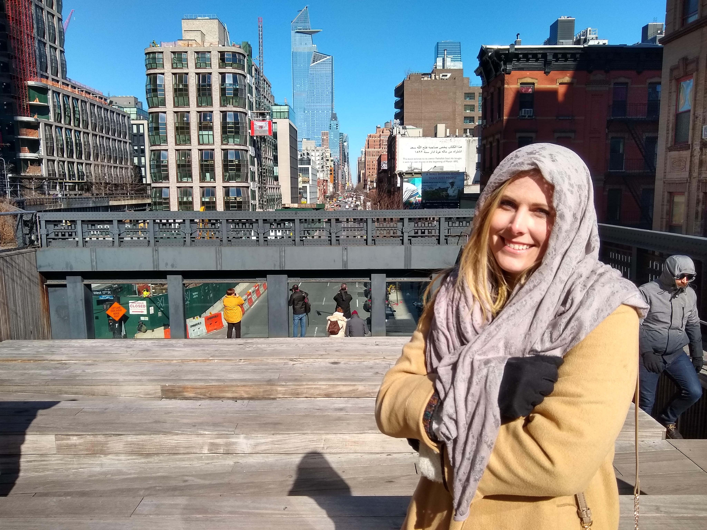
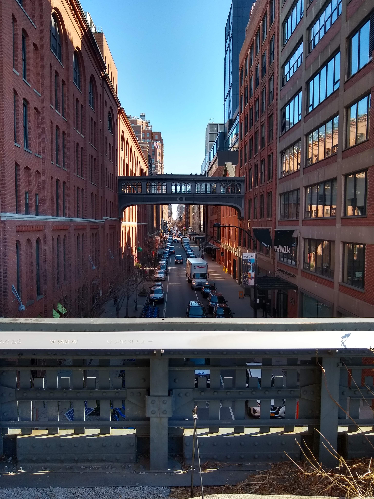
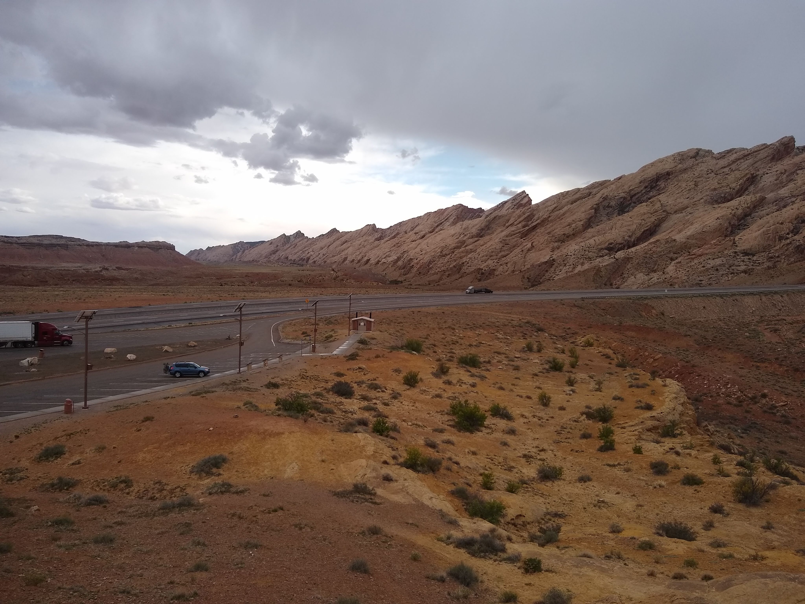
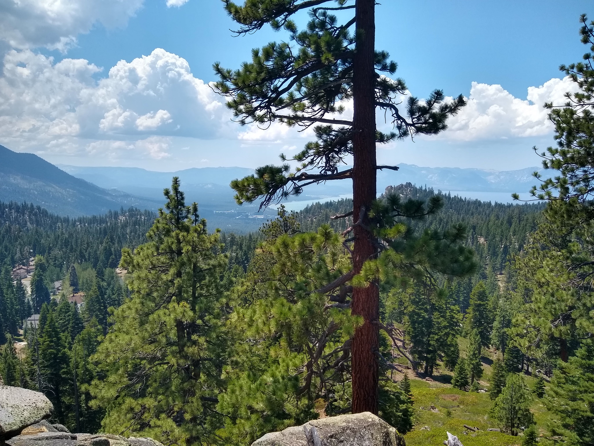

This past February, I had the privliege to attend 2020 AAAI Conference in New York City. I was selected into the Doctoral Consortium, which serves as a workshop for promising PhD students in the greater AI community. I had a wonderful time meeting people from all walks of life and enjoying the world's most cosmopolitan city. I got to sit in on all sorts of interesting talks on all sorts of topics in AI and Machine Learning. I even sawy Geoffrey Hinton, Yann LeCunn, and Yoshio Bengio recieve their Turing Awards. Pretty amazing!

Missy also came to vist the weekend proceeding the conference. My parents also came down that weekend. My Uncle, Charlie Mueller PhD, took us to see Book of Mormon. It was truly hilarious and I hihgly recommend seeing it. Missy and I also saw the Lumineers in Brooklyn. The ongoing theme was the bitter cold. It was as cold as the East Coast gets.
 

A month or so after the conference, I found out that I was also accepted into the HRI Pioneers workshop. This is a similar event as the AAAI Doctoral Consortium but more focused on an individual paper, and much more focused on my niche field of Human-Robot Interaction. Unfortunately, the conference was cancelled due to the COVID19 pandemic. I was supposed to go to Cambridge, UK so I was quite disappointed. What crazy times.
 
Due to CU Boulder shutting down in the late Spring and through the Summer, I was fortunate to be able to go to California and live with Missy for the summer. We didn't get to do much since we were respecting social distancing, but we did sneak a trip to South Lake Tahoe. I got some solid mountain biking in there, and throughout the summer. I may have also got a new mountain bike as well....But more importantly, it was really nice to be able be with Missy as we still do long-distance. 

I also am no longer with the Deming Center Venture Fund as I resigned from my position as Portfolio Manager. I wanted to clear up commitments and focus on getting as much research accomplished this year as possible. It was a great experience and I wish the team the very best!

