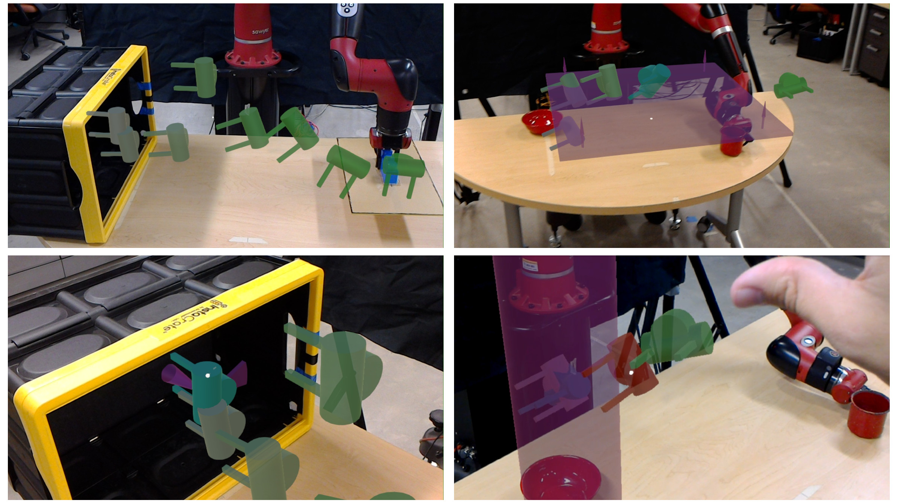
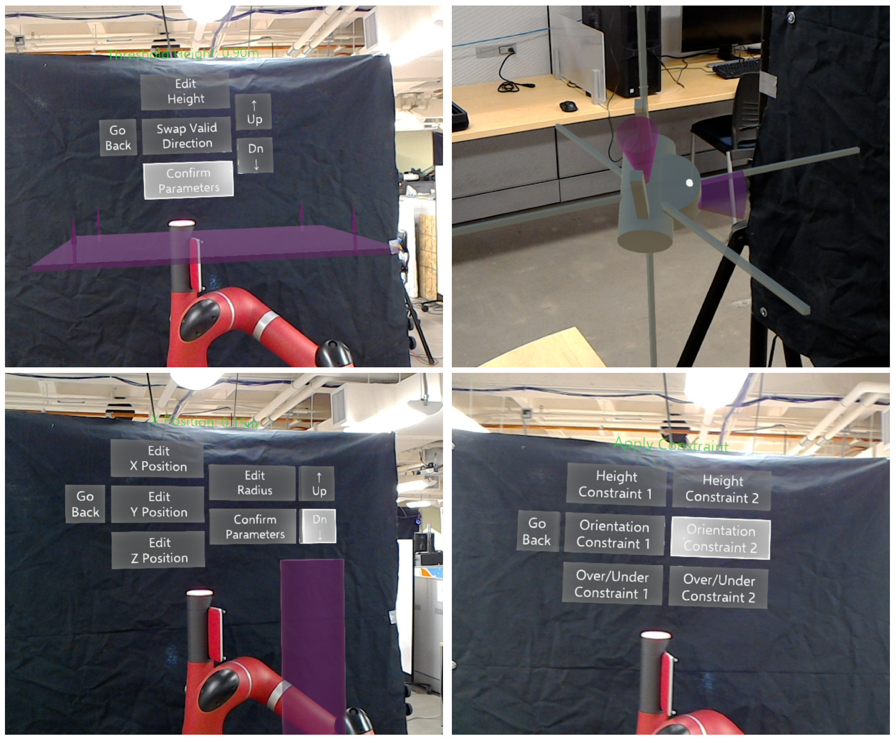
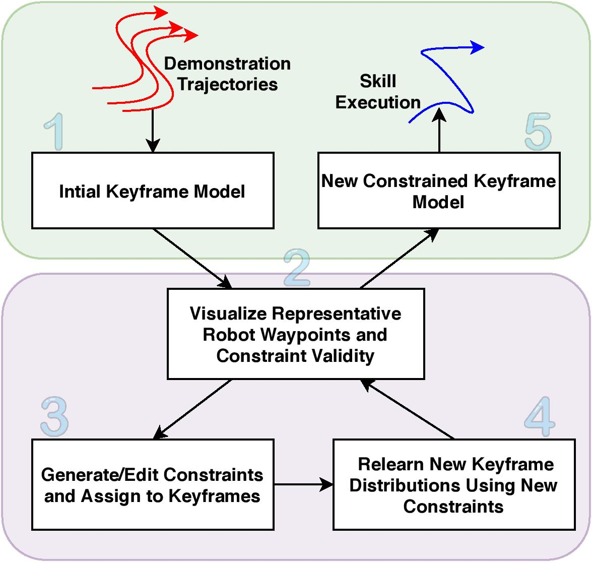
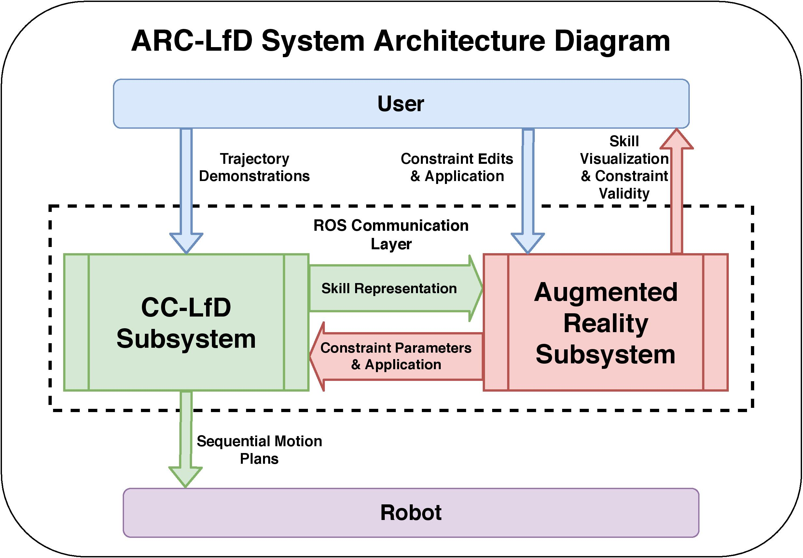

We recently submitted a paper to ICRA 2021 that utilizes Augmented Reality to visualize models learned through user demonstration as well as an interface to add/remove/edit constraints on those models.

## Overview

ARC-LfD is an augmented reality interfaces that enables users to visualize a learned keyframe model from CC-LfD. It accomplishes this through visualizations of sampled keyframes that the robot will follow as waypoints, as well as visualizations of constraints assigned to keyframes. In the below image, you can see sequences of expected robot behavior through keyframes, as well as visualizations of applied constraints.

ARC-LfD also enables users to edit constraints through menus that allow for constraint specific parameter editing. Users can also add and remove the application of constraints by selecting an end-effector keyframe.

Below is a video describing the ARC-LfD system:

`youtube:https://www.youtube.com/embed/X0H7rszq-QA`

## Interaction Flow

The use interaction flow for the ARC-LfD:

1. Recording of demonstration trajectories and constraints
2. Visualization of the learned model
3. Constraint editing/application
4. Relearning of Constrained Keyframe Model via CC-LfD algorithm
5. Model acceptance and resulting skill execution

The iterative aspect is represented by the looping of steps 2, 3, and 4.

## Architecture 

The ARC-LfD architecture consists of two major subsystems:

1. Augmented Reality Subsystem
2. CC-LfD Subsystem

These two subsystems communicate via the pub/sub architecture of the Robot Operating System (ROS). Any time the user updates constraints on the mode, the AR Subsystem sends those updates to the CC-LfD subsystem which produces a new model, and sends a representation back to the AR Subsystem to update the visualizations.

## Future Work

Future work will consist of running human-subjects studies to test the efficacy of this system both objectively: the skill success percentage compared to traditional constraint application, and subjectively: do users display a preference using this interface?

## References

<bibliography><bibliography>

