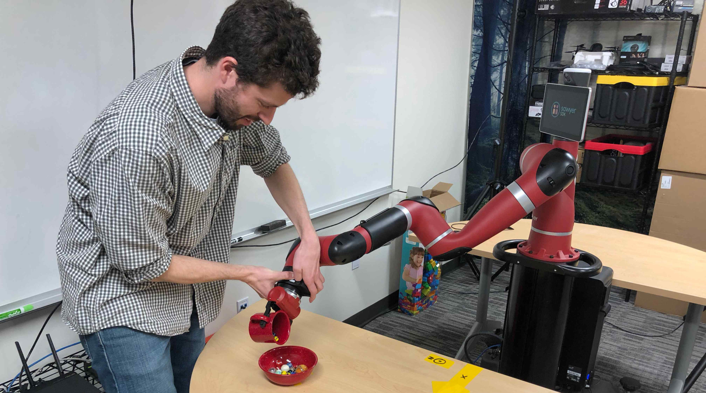
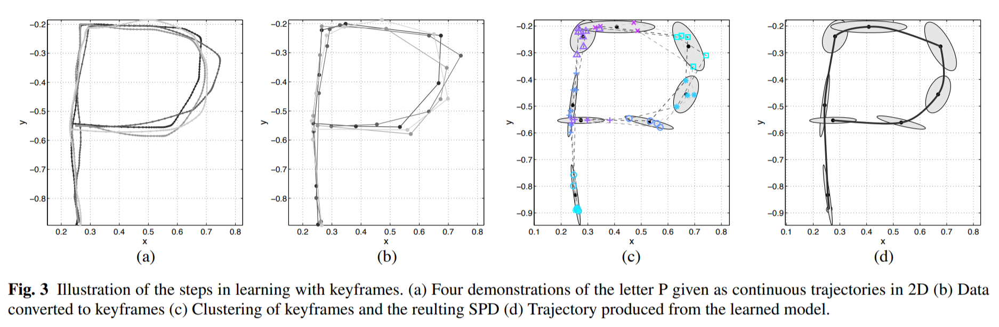
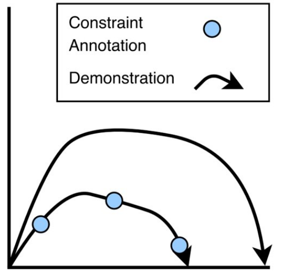
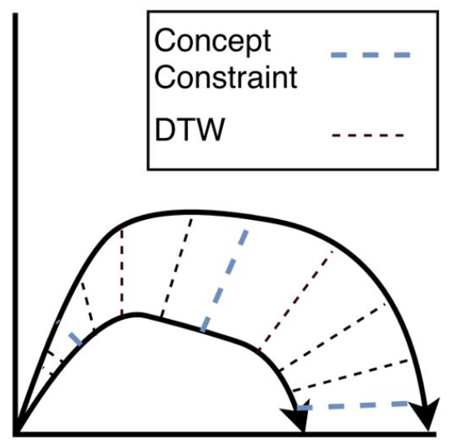
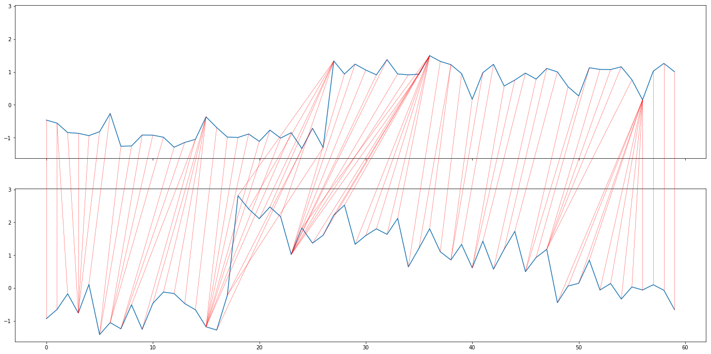
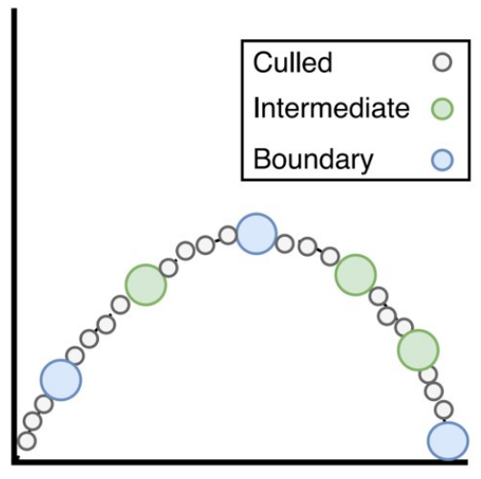
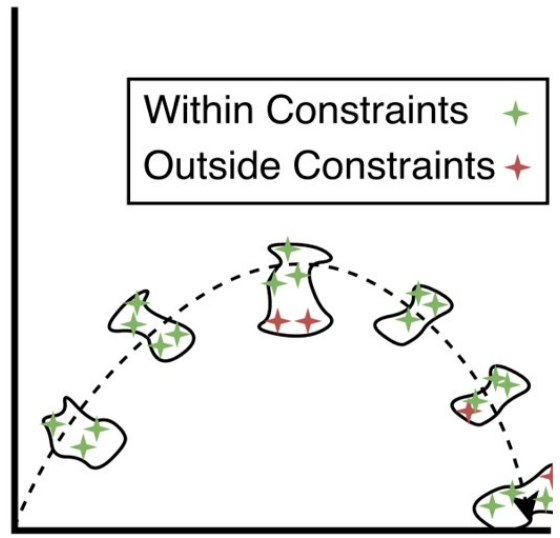
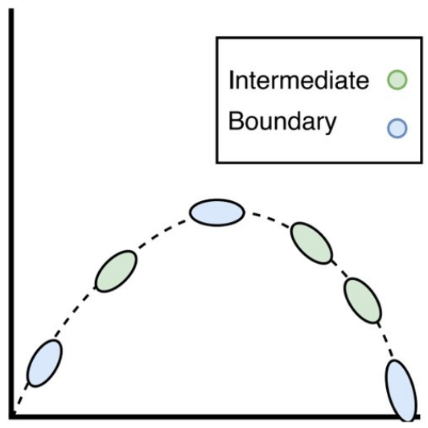
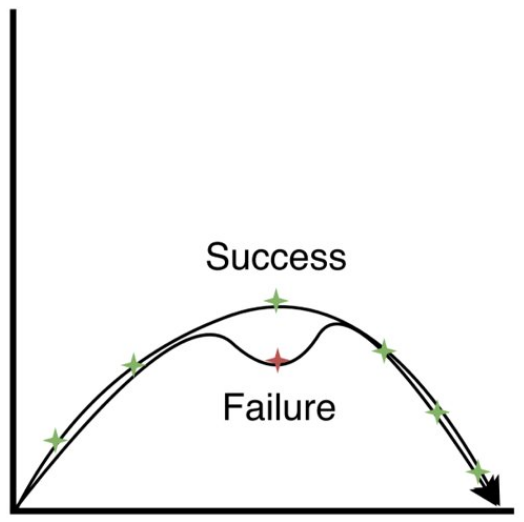

## Why is this important?

My PhD research's seminal work is called **Concept Constrained Learning from Demonstration** \cite{mueller2018robust}. It is this work that motivates my current research into constrained motion planning and human-robot interfaces, specifically augmented reality interfaces. Ultimately, I want to figure out how to make robots easily trainable and usable by non-roboticists. Physical automation is a wide-open frontier in the world of information technology. However, the introduction of collaborative robots into human environments presents a number of challenges often not required of large-scale industrial robots: safety in shared workspaces, rapidly changing task requirements, decision-making, and, perhaps most challenging, adhering to human expectations of behavior. As such, the foundational motivation behind this work is to provide human users the means to easily train collaborative robots to execute dynamic skills while adhering to important behavioral restrictions.

## Background

### Learning from Demonstration

Robot Learning from Demonstration (LfD) consists of methods that attempt to learn successful robot behavior models from human input. A human operator interacts with a robotic system through some mode of demonstration, usually through kinesthetic demonstration, teleoperation, or passive observation [^1]. Demonstration ideally communicates information about the nature of the skill that the robotic learning system uses to build a learned model that resembles some latent (i.e. hidden) ground truth model. The methods by which robotic systems learn such models spans across the spectrum of machine learning. However there are three broad categorizations for robot LfD systems: 1) plan learning, 2) functional optimization, and 3) policy learning  \cite{ravichandar2020recent}.

The ultimate goal of these learning methods is to facilitate the transfer of information from a non-roboticist, with some expert intuition about the skill, to the robotic learning system. This information is then used by robot skill learning methods to produce successful learned models of the task. Plan learning methods attempt to learn models that operate at high levels of task abstraction, either learning a primitive sequence or hierarchy. Functional optimization methods either directly optimize a candidate trajectory (potentially one derived from demonstration) using a known objective function, or they attempt to learn an objective from demonstration. These approaches often emulate or directly draw from Reinforcement Learning and Inverse Reinforcement Learning techniques. Lastly, policy learning methods produce models that output either trajectories or low-level actions directly [^2].

### Keyframe Learning from Demonstration

CC-LfD is an augmentation of a learning method called Keyframe LfD (KLfD) \cite{akgun2012keyframe}. In traditional KLfD, human operators teach a skill by providing distinct waypoints of robot state data. This represents a coarse trajectory for the robot to follow. This approach is powerful because it very easily allows users to specify robot motion, but it is somewhat brittle as the learned skill is really a concrete instantiation of one robot trajectory. Any variation to the environment or to changes in user expectations cannot be accommodated.

Keyframe LfD can be made more robust through automating keyframe generation and through statistical learning. To automate this approach, users first provide high-rate-of-sampling demonstration trajectories of the skill, ideally expressing subtle variation. Demonstration trajectories are aligned using a technique called Dynamic Time Warping \cite{}, which is an algorithmic method to align similar regions in sequential data from one sequence to another. The data points of these temporally aligned demonstration trajectories are clustered into sequential groups across demonstrations. These clusters of robot state data are fitted to learned *keyframe distributions*, which are used to generate waypoints that the robot follows sequentially to perform a skill. Forming statistical distributions to represent keyframes, as opposed to single points, enables the LfD algorithm to adapt to behavioral restrictions the human operator might decide to place on the robot.

## Concept Constrained Learning from Demonstration

To this end, an algorithm called Concept Constrained Learning from Demonstration integrates behavioral restrictions, communicated by the user, into the keyframe LfD model. These restrictions are dubbed 'concept constraints' which represent prohibitions on the behavior of the robot system. This is accomplished by encoding concept constraints as Boolean planning predicates which when combined into logical forumlae and represent a multitude of concurrent constraints on the learning of keyframes. These planning predicates serve as rejection samplers during the distribution learning phase as well as the skill reconstruction phase. 

### Algorithm Overview

The algorithm follows these broad steps (right to left in the image cluster): 

1. Recording of Demonstration Trajectories and Constraints
2. Alignment of Trajectories
3. Clustering and Rejection Sampling Models
4. Culling of Keyframes
5. Remodeling
6. Skill Execution

#### Recording of Demonstration Trajectories

The first step in CC-LfD, as with most LfD algorithms, is to capture demonstration trajectories provided by human operators. In CC-LfD, robot demonstration trajectories are captured via kinesthetic demonstration. What is unique to the CC-LfD demonstration process is that human teachers can provide constraint annotations. An annotation indicates the spatio-temporal region of a trajectory where a given constraint must hold true. In the published version of this work \cite{mueller2018robust}, this constraint annotation was done manually through programmed arm cuff buttons on the robot during experimentation. However, future work plans to use an augmented reality interface or to utilize a natural language interface. 

#### Alignment

After capturing demonstration trajectories, an important step is to generate a mapping between the points of one trajectory with points in the other. Under the assumption that a human operator demonstrates repeatedly the same skill, drawing from a consistent skill distribution, it is important to be able to know which regions of one trajectory correspond with regions in another.

One important caveat in this alignment process is that the algorithm takes special note of constraint annotation boundaries, regions in spatio-temporal regions in a trajectory where the set of applied constraints changes.

#### Clustering and Rejection Sampling Modeling

The bulk of the algorithm's novelty lies in the way it facilities the learning of keyframes. Once an alignment is completed, sequential clusters of aligned points serve as the basis for keyframe models. Each cluster of points are fitted with a statistical distribution (in this case Kernel Density Estimation). By modeling waypoints as distributions, rather than single points, we can integrate constraints by performing rejection sampling. Each inintial keyframe is sampled for collision free and constraint compliant points. After N number of such points are sampled, the distributions are refitted to this new sample set. This effectively shifts the keyframe distributions to become more representative of constraint-compliant collision-free configuration space.

#### Culling

Once a dense sequence of keyframes is produce, the intermediate keyframe density is reduced to generate a more sparse model. It is important to note that keyframes representing when the set of applied constraints change are kept. 

#### Reconstruct Skill

Finally a skill is reconstructed by sampling in-sequence constraint-compliant waypoints from each keyframe distribution. Motion planning methods are then used to traverse from waypoint to waypoint.

## Limitations & Future Work

A limitation of CC-LfD is it's reliance on unconstrained motion planning. If an environment change introducing an intermediate keyframe occlusion, the motion planners cannot rely on the density of sequential keyframes to maintain constraint adherance. Our guess as to why constraint copmliance does occur in motion planning in the first place is because the density of keyframes effectively restricts the space of feasible motion plans to likely sit within the same space as constraint-compliant motion plans. This is also because the demonstration data to produce these keyframes generally show constraint-compliant paths. 

However, with occluded keyframes, the motion planning algorithms need to diverge away from the initial demonstration trajectory distributions in order to produce a collision-free motion plan. This divergence suddenly exposes the constaint naievete of unconstrained motion planners. Future work will look into integrating constrained motion planners into CC-LfD.

## References

<bibliography></bibliography>

##### Footnotes

[^1]: In kinesthetic demonstration, a human operator physically manipulates the robot to enable its sensors to capture a trajectory. In teleoperation, the operator utilizes a remote control device to manipulate the robot. In passive observation, the robot's external sensors observe a human demonstrating the task. This last method introduces something called the **correspondence problem**: how does one map observational demonstration data to robot control state data?

[^2]: CC-LfD falls under the policy learning category, where the constrained acyclic directed keyframe graph generates a rough motion plan for the robot to follow. The graph model represents a policy that dictates robot behavior.